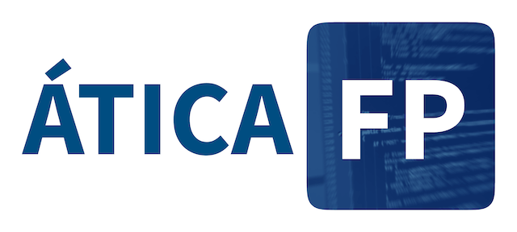

# Introducción a ÁTICA-FP

Es una **aplicación web** para ayudar en el seguimiento del alumnado de FP durante la
**Formación en Centros de Trabajo** y durante el período de alternancia de **FP dual**.

Concretamente, intenta que la comunicación entre centro educativo y las entidades colaboradoras sea ágil,
eficaz e instantáneo. Esto incluye registrar las actividades realizadas fuera del centro, los contactos/visitas y
reuniones de tutorización realizados por el profesorado y la valoración del desempeño de los estudiantes.

El código del proyecto es [software libre](https://www.gnu.org/philosophy/free-sw.es.html)
bajo licencia [AGPL versión 3] con lo que puede desplegarse en tu centro educativo sin necesitar ningún tipo
de autorización e incluso modificarlo para adaptarlo a nuevas necesidades. Eso sí, los cambios y mejoras que
se introduzcan deben estar disponibles para quien quiera incorporarlos. De esta manera, todos salimos ganando.

La aplicación se nutre de información que debe ser introducida en la plataforma. Siempre que ha
sido posible, hemos intentado que se pueda importar información previamente exportada desde el
Sistema de Información Séneca, de la Consejería de Desarrollo Educativo y Formación Profesional de la
Junta de Andalucía. Dado que la base de Séneca también se usa en otras comunidades autónomas (con otro
nombre, eso sí) puede que el formato de exportación sea compatible.

Se puede seguir el desarrollo de esta herramienta vía Twitter siguiendo a [@aticaFP] o
[desde su repositorio GitHub](https://github.com/iesoretania/atica-fp).

Este proyecto está desarrollado en PHP utilizando [Symfony] y otros muchos componentes que se instalan usando
[Composer] y [npmjs].

[Symfony]: http://symfony.com/
[Composer]: http://getcomposer.org
[AGPL versión 3]: http://www.gnu.org/licenses/agpl.html
[Node.js]: https://nodejs.org/en/
[npmjs]: https://npmjs.com/
[@aticaFP]: https://twitter.com/aticaFP
